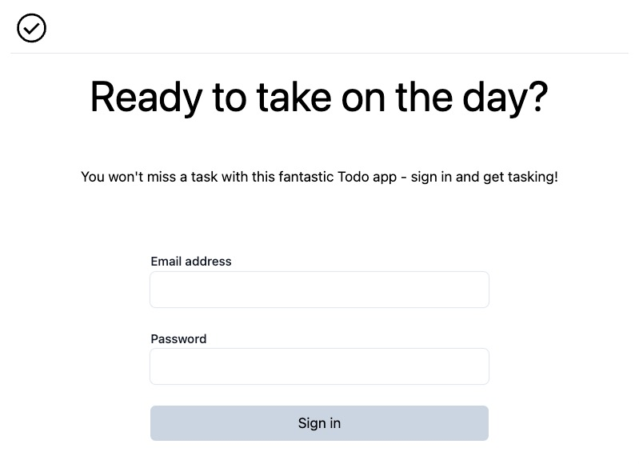
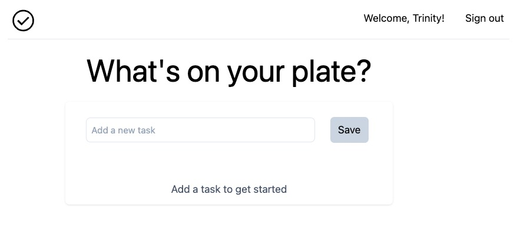

# Okta Enterprise Readiness Workshops

This repository contains the base application for the OktaDev Enterprise Readiness workshops. From the base application, you'll learn how to add the features you need to your SaaS app in order to land enterprise-level customers.

> This repository should not be used as a template for production ready code. It is intentionally simplistic and minimal so you can focus on the topics covered in the workshop content.

The base application is a minimal "todo list" application, built as a B2C application. There are four workshops that take this base application and enhances it for your enterprise customers:

1. **Onboard your customer's workforce with OpenID Connect** - Enable your customers to bring their existing users into your app using [OpenID Connect (OIDC)](https://openid.net/developers/how-connect-works/), an industry-standard authentication mechanism.
2. **Sync all your customer's users with SCIM** - Give your app the complete picture of your customer's user base using [System for Cross-domain Identity Management (SCIM)](https://scim.cloud/).
3. **Enable automation and integration with Workflows** - Enable your customers to automate actions within your app using a low/no-code configuration mechanism.
4. **Automate Okta management with Terraform** - Automate environment creation and ensure consistency in managing your Okta organization using Terraform.

Each workshop is independent, so you may choose the workshops that best address your next most pressing need.

**Table of Contents**

* [About this application](#about-this-application)
* [Getting started](#getting-started)
* [Help](#help)
* [License](#license)

## About this application

This application is a [React](https://react.dev/) frontend and [Express](https://expressjs.com/) API backend using [Prisma](https://www.prisma.io/) ORM over [SQLite](https://www.sqlite.org/index.html) db. The entire project is in a [Nx workspace](https://nx.dev/).

Depending on the specific workshop you're participating in, you may need some knowledge of JavaScript, REST concepts, and commandline operations.

**Prerequisites**

* [Node](https://nodejs.org/en) v18
* [npm](https://www.npmjs.com/) v9 (Installs automatically with Node)
* [Git](https://git-scm.com/)
* [GitHub account](https://github.com/)
* Okta Developer Edition account
> [Okta](https://developer.okta.com/) has Authentication and User Management APIs that reduce development time with instant-on, scalable user infrastructure. Okta's intuitive API and expert support make it easy for developers to authenticate, manage and secure users and roles in any application.

The application was built using Node v18.14.0, npm v9.3.1.

## Getting started

To get a local copy of the project and to install dependencies, run the following commands:

```bash
git clone https://github.com/oktadev/okta-dev-workshops.git
cd okta-dev-workshops
npm ci
```

Next, seed the db with two users. Run the script below and you'll see the users and their passwords written to the commandline:

```bash
npm run init-db
```

### Start the application

Start both the frontend and backend using the npm command below.

```bash
npm start
```

Access the Todo app at `localhost:3000`. You should see the following signin page:



You will sign-in using the email and password of one of the two users, which will navigate you to the Todo app where you can start adding, completing, and deleting todos.



### Call the API directly

Access the API at `localhost:3333` if you want to target specific API endpoints using a HTTP client.

### Manage the database

If you need to inspect the db, you can use Prisma studio. Run the following command:

```bash
npx prisma studio
```

## Help

Please file issues you encounter using this code sample [as a GitHub issue](https://github.com/oktadev/okta-dev-workshops/issues). Please post any questions about [a specific workshop](ALISA - Fill out links when you have them), or visit our [Okta Developer Forums](https://devforum.okta.com/).

## License

Apache 2.0, see [LICENSE](LICENSE).
